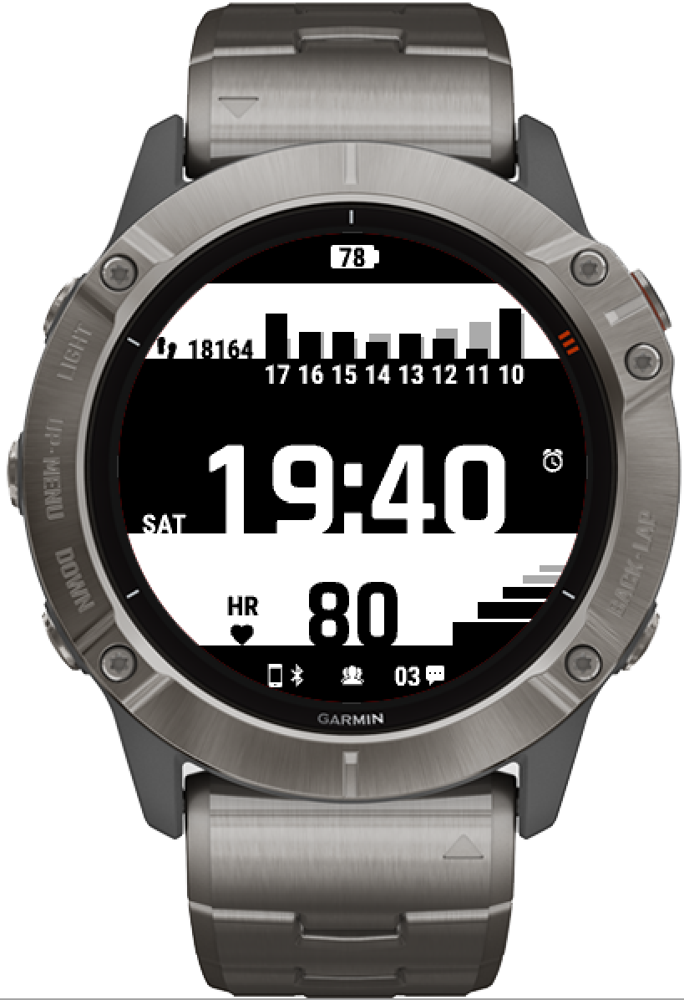

# AlejacmaW2

My second watch face for Garmin Fenix 6X.

# Useful links

Official documentation and samples:
- [Garmin Connect IQ for developers](https://developer.garmin.com/connect-iq/overview/)
- [Monkey C Language Reference](https://developer.garmin.com/connect-iq/reference-guides/monkey-c-reference/)
- [Toybox API docs](https://developer.garmin.com/connect-iq/api-docs/index.html)
- [Device reference](https://developer.garmin.com/connect-iq/reference-guides/devices-reference/)
- [Connect IQ apps and libraries](https://github.com/garmin/connectiq-apps)

Fonts:
- [Garmin Icon Fonts](https://github.com/sunpazed/garmin-iconfonts)

Other watch faces with source code:
- [Connect-IQ-WatchFace](https://gitlab.com/ravenfeld/Connect-IQ-WatchFace)
- [Connect IQ Apps with Source Code](https://starttorun.info/connect-iq-apps-with-source-code/)